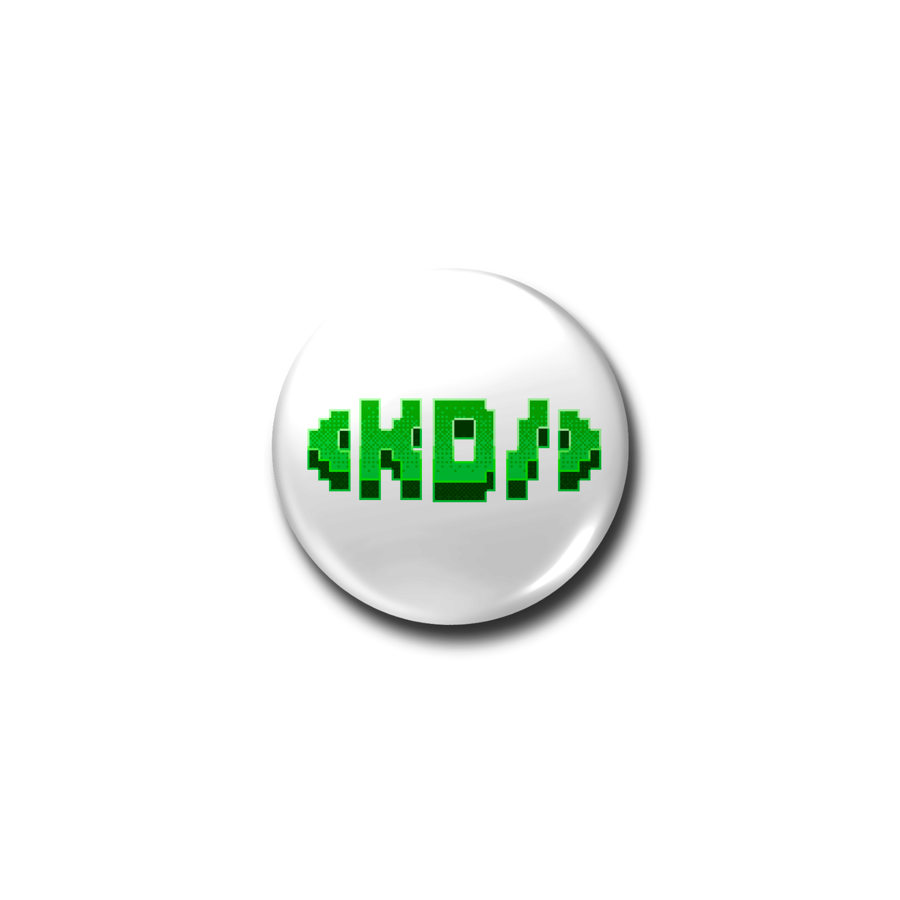
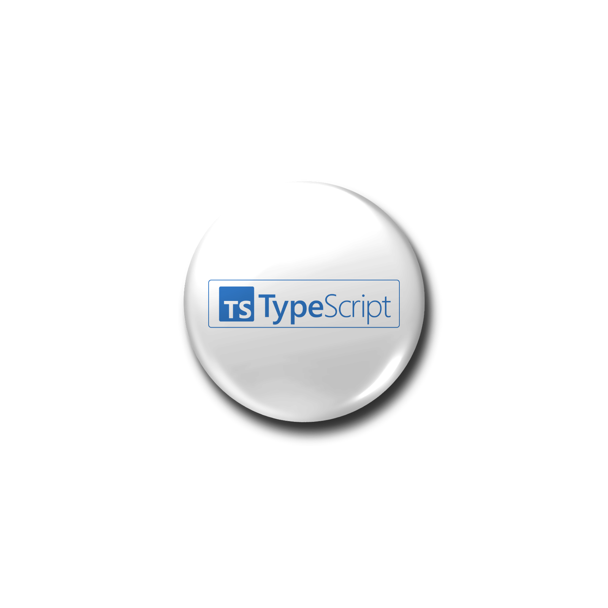

# KRACKED DEVS Penzine — Megazine Engine v2.0

```
                                                                                                    
                                                                                                    
                                                                                                    
                        :::::::     ::::::   ::::::::::::::::::::           ::::::                  
                        :*****:     =****=:  -**************:           =****=                      
               :=+=++-  :***+*:     =****=:  -***********+**++:         =****=  :=++++:             
            ::::*****=  :*****:  :::+****=:  -*****+====+*****-      :::+****=  :*****=:::          
            :=+++++++-  :+++++:  :+++*+++=:  -++*+=%%%%%%+++*+-     :=**+++++=  :+*++++*+:          
         :-+++*+*++##+  :+*+++++=+++*+*+#*   -++*+=%%%%%%+*+*+-     :=*+*+=%%*  =##*+++*+++=:       
         :=+++++++=%%*  :+++++++++++++++%#+  -++++=*%%%%*+++++-     :=++++-%%#  +%%*++++++++:       
         :=+++++++=%%*  :++++++++++++++=%*+  -++++=:    :+++++-     :=++++-%%*  +%%*++++++++:       
         =+*++++++=++=  -++++++**++++++===   -++++=-    -=++++-  --===++++-+++  =++=++++++**=       
         +#%#=+++++++=  -++++++%%++++++++=   =++++=-    -=++++=  -=+++++++=     -+++++++++%%+       
         +#%%##*+++++=  =+++++*%%%##+++++==  =++++++++++++++++=  =++++++##*     =++++++###%%+       
         +*##%%%++*+*+  =++++++###%%=++++==  =+++++++++++++++++  =+++++=%%*     =+*****%%###+       
            +#%%%%%%%*  =+++++=  +#%=++++==  =++++++++++++++*%*  ==++++=%%*     +%%%%%%%%+          
               +#%%%%*  +%%%%%+     #%%%%#+  +++++++++++++++#%*  +#%%%%*        +%%%%%+             
               +*####*  +%%%%%+     #%%%%#+  *%%%%%%%%%%%%%%%#+  +#%%%%*        +#####+             
                        +%%%%#+     *%%%%*+  *%%%%%%%%%%%%%%+    +*%%%%*                            
                                             ++++++++++++++++                                       
                                                                                                    
                                                                                                    
                                                                                                    
```

<p align="center">
  
  
  
  
  
  
</p>


> **Credit & home:** [www.krackeddevs.com](https://www.krackeddevs.com) — the self-sustaining Malaysian builder ecosystem that this magazine belongs to and reports on. Created by [@RikayuWilzam](https://www.krackeddevs.com).

Interactive editorial megazine with a horizontal scroll landing page, 3D page-flipping, volume management, and hand-tracking gestures. The **KD Penzine** is KrackedDevs' own journal — the community-written record of what Malaysian developers are building, shipped monthly as numbered "volumes" of markdown pages.

**Live:** https://kd-penzine.pages.dev · **Alias:** https://master.kd-penzine.pages.dev

## What is KD Penzine?

KD Penzine is the official journal of the KrackedDevs community. It turns the network's monthly output — builds, essays, bounties, ecosystem news — into a long-form, page-flipping magazine. Each **Volume** is a themed issue (e.g. *The Voice*, *The Spatial Quarter*), compiled from the community and the wider Malaysian/IJSEA AI ecosystem.

## How to Contribute — Journaling

Anyone in the network can contribute to a future volume. The magazine believes **the network writes its own story**, and every contributor is credited as co-author.

- **Submit a node** — a build you shipped, an essay on where AI is going, a tool you love, or a lesson you learned the hard way. Anything that's local, practical, and real qualifies.
- **Vote** — when the shortlist is live, the community votes on which nodes make the next volume.
- **Where** — submissions and votes go through the form at [krackeddevs.com](https://www.krackeddevs.com).

Strong nodes are **local, practical, and shipped** — real builds and real perspectives over polish.

## Key Achievements — KrackedDevs × Malaysia

A snapshot of the ecosystem the magazine reports on:

- **AIMTO × MyDIGITAL research partnership** — collaborative research aligning the community's AI practice with Malaysia's national digital-economy roadmap.
- **KD Labs product suite** — community-built, community-shipped tools: `jomqr.my` (QR digital cards), `kuntum.app` (AI-native hiring), `mypeta.ai` (Malaysia tech map), `wiki.krackeddevs.com` (ecosystem index), `fluid.krackeddevs.com` (generative backgrounds), and `pasarapi.xyz` (verified SE Asian APIs).
- **KD Academy** — structured learning paths, bootcamps, and workshops focused on practical AI training.
- **KD Community** — Guilds (e.g. Pingu-Tech Devs, PeakyBuildr), hackathons, bounties, and live events across Discord, X/Threads, and the KD Square forum.
- **Bounty-backed community volumes** — a monthly (initially weekly) editorial loop that compiles each issue from community submissions, votes, and the ecosystem pulse.

## Stack

- React 19 + Vite (entry: `index.tsx` → `App.tsx`)
- React Router v8 (hash router, imports from `react-router`)
- Tailwind (CDN) + Claude-editorial design tokens in `index.css`
- Deployed on **Cloudflare Pages** (project `kd-penzine`). Static only — no Worker, no API keys.

## Getting Started

```bash
npm install
npm run dev          # Vite on http://localhost:3000
```

## Deploy

```bash
npm run pages:deploy            # builds dist/, uploads → https://kd-penzine.pages.dev
npm run pages:dev               # local Pages test
npm run tunnel                  # expose localhost publicly (needs dev running)
```

## Verify

```bash
npx tsc --noEmit
npm run build
```

There is **no lint or test setup** — `tsc` + `build` are the only checks.

## Features

### 1. Landing Page (HorizontalLanding.tsx)
Seven snap-scroll sections — **Hero · Archives · FAQ · Blog · About · Roadmap · Connect** — with a floating glass nav pill, noise-grain overlay, bottom section dots, and a mouse-tracking KD pixel logo. FAQ content is sourced from the real krackeddevs.com ecosystem (Guilds, KD Labs, KD Academy, Bounties, etc).

### 2. High-Density Magazine Format
Dense editorial layout with dynamic font scaling and multi-column CSS.

- **Bolding**: Markdown `**` tags render as high-contrast editorial bold blocks.
- **Auto-Fit**: Aggressively scales font sizes to fit character counts from 500 to 3000+.
- **Content**: text (`#`/`##`/`###`, `**bold**`, `- lists`), images (``), figures (`[FIGURE: url|alt|caption]`), captions (`[CAPTION: text]`), datelines, abstracts, margin notes (`[MARGIN: text]`), and video (`[VIDEO: youtube_url]`).
- Legacy `[SOCIALS:]`, `[BADGE:]`, `[SIGNATURE:]`, `[TWITTER_FEED:]` directives are treated as plain text.

### 3. Hand Tracking
Camera-based page turning via MediaPipe hand landmark detection (loaded on demand, progressive enhancement). *Foundation build only — fully functional on the 3.0 engine.*

- Wave left → next page, wave right → previous page.
- Click the HAND pill to enable; auto-calibrates on first hand detection.
- Falls back to keyboard arrows, drag, wheel, and tap.

### 4. Volume Builder (CMS)
`/#/krackedmin-admin` — edit page markdown per volume, import a JSON volume structure, toggle publish status, and save to `localStorage` (`kd_volumes`).

### 5. Embed & Shortcodes
- **Shortcode Format**: `[VOL_VIEW_X]`
- **Embed URL**: `.../embed/volume-name`

### 6. Per-Volume Theme System
Each volume carries a theme (`neon/editorial/amber/teal/terra/bronze/violet/ocean/sage`) resolved by `resolveTheme(volume, index)`. CSS-only theme backgrounds via `theme-bg theme-<variant>`.

## Directory

- `App.tsx` — router + content bootstrapping (seed vs localStorage)
- `pages/MegazineReader.tsx` — reader shell
- `components/Megazine/` — `Book`, `Page`, `Intro` (legacy), `HorizontalLanding`, `VolumeSelector`, `useHandTracking`
- `components/CMS/PageBuilder.tsx` — volume editor
- `content/volumes.ts` — `VOLUME_SEED`, 8 volumes of markdown (Jan–Aug 2026)
